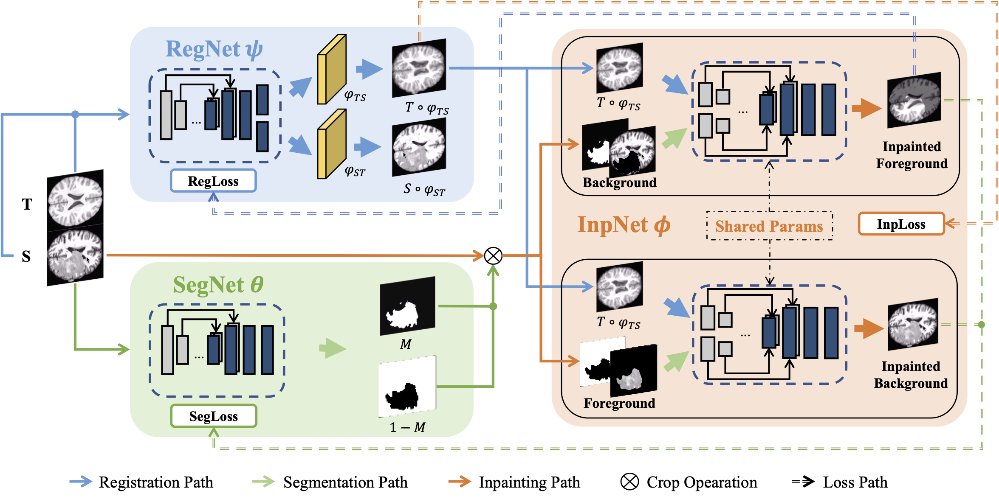

# GIRNet: Co-Learning Semantic-aware Unsupervised Segmentation for Pathological Image Registration
[](https://arxiv.org/abs/2310.11040)
[](https://link.springer.com/chapter/10.1007/978-3-031-43999-5_51)

The official implementation of our **MICCAI 2023** paper "GIRNet: Co-Learning Semantic-aware Unsupervised Segmentation for
Pathological Image Registration". The code is based on the [Voxelmorph](https://github.com/voxelmorph/voxelmorph).

---


# BibTeX (Citation)


If you find this repository useful for you, please consider citing our paper.
```
@inproceedings{liu2023co,
  title={Co-learning Semantic-Aware Unsupervised Segmentation for Pathological Image Registration},
  author={Liu, Yang and Gu, Shi},
  booktitle={International Conference on Medical Image Computing and Computer-Assisted Intervention},
  pages={537--547},
  year={2023},
  organization={Springer}
}
```
## Requirements

+ Python 3.8 +
+ Pytorch 1.10.0
+ NumPy
+ NiBabel
+ Monai

This code has been tested with Pytorch and GTX TITAN XP GPU.

## Dataset

+ [BraTS 2020](https://www.med.upenn.edu/cbica/brats2020/data.html)
+ [OASIS](https://www.oasis-brains.org/#data)
+ [BraTSReg with Landmarks](https://www.med.upenn.edu/cbica/brats-reg-challenge)
+ PseudoDataset:

## Training

If you want to train a new model using your own dataset, please align your own data to your atlas with FreeSurfer first.
The `utils/data_preprocess.py` script can be used to generate NIFIT1 images for training with multiprocess. For
example, if we have a list of images in `data/OASIS`, we can align the images to atlas and generate pseudo dataset using
the following command:

```
python data_preprocess.py --task atlas 
python data_preprocess.py --task pseudo 
```

Then use the `utils/data_split.py` script to split the data into training and validation sets. For example, if we have
a list of images in `data/OASISAligned`, we can split the images using the following command:

```
python data_split.py --in-dir data/OASISAligned --out-dir data_json/OASISAligned
```

### Inpainter Pretraining

To enhance the training efficiency, we employed inpainter pretraining using the `pretrain_inpainter2.py` script. This
process involved randomly cropping images from the OASIS dataset, which served as the training data for the inpainter
model. By pretraining the inpainter, we aim to improve its ability to fill in missing or corrupted regions in images.
The pretrained model checkpoint is saved at `./checkpoint/inp.pth` for future use.

### GIRNet Training

Following the inpainter pretraining, we proceeded with the training of the GIRNet model using
the `train_GIRNet_Pseudo.py` script. To initiate the training process, execute the following command:

```
python train_GIRNet_Pseudo.py --device 0 --name BraTSPsuedoHisto --mark noexclude221_MNI152_ntuc_histomatch_sym_y2xrec_win15 --epochs 500 --resume -s 0 -e 1
```

This command will train the GIRNet model with the specified settings, such as using GPU device 0, assigning the name "
BraTSPsuedoHisto" to the result dirname, and training for 500 epochs. The `--resume` flag indicates that training will
resume from the last saved checkpoint. `-s` and `-e` denote the fold.

Upon completion of training, the results will be stored in the directory
path: `GIRNet/result/GIRNet5_BraTSPseudoHisto/noexclude221_MNI152_ntuc_histomatch_sym_y2xrec_win15`. This directory will
contain various files and subdirectories related to the trained model and its evaluation.

Before commencing the training process, it is essential to ensure that the `inp.pth` checkpoint file is copied to the
following
location: `GIRNet/result/GIRNet5_BraTSPseudoHisto/noexclude221_MNI152_ntuc_histomatch_sym_y2xrec_win15/fold_0_t1/inp.pth`.
This step is crucial as the GIRNet model relies on the pretraining of the inpainter, and the checkpoint file needs to be
accessible during training for proper initialization and utilization.

## Parameter choices

For the Minimal Mutual Information loss function, we use `win=15` in all experiments. The registration loss we follow
the setting of the original paper.
